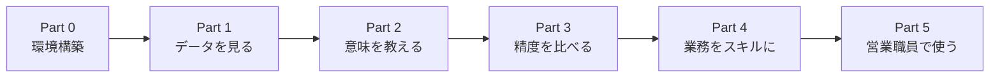
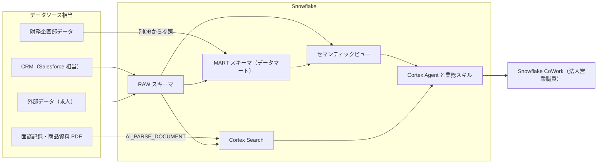

# 生命保険 法人営業向け Snowflake AI ハンズオン

CRM・面談記録 PDF・他部署データ・外部データを Snowflake に集約し、
**セマンティックビューを作ると Cortex Agent の回答がどう変わるか**、
そして **法人営業職員が CoWork で意図した回答を得られるか** を、2時間で実際に触って確かめるハンズオンです。

操作はすべて Snowsight 上で行い、作業の多くを **CoCo in Snowsight**（Cortex Code）と **Semantic Studio** に任せます。

---

## 概要

あなたは架空の生命保険会社 **スノー生命** の法人営業企画部の担当者です。現場の法人営業職員から、こんな声が届いています。

> 「訪問前に CRM・面談メモ・財務資料をあちこち見に行くのが大変。一言で聞いたら、まとめて返ってきてほしい」

> 「AI に聞いても、社内の用語やルールを分かっていない答えが返ってくると怖くて使えない」

このハンズオンでは、次の4点を順に確かめます。

1. **データ投入**: CRM・PDF・他部署データ・外部データが1つの基盤に集まる
2. **セマンティックビューの作成**: 業務の言葉（見込みランク、受注、千円単位、年度など）をデータに結びつける
3. **Agent の精度**: 意味づけのない Agent と意味づけのある Agent に同じ質問をして、回答を比べる
4. **CoWork での業務活用**: 法人営業の業務フローをスキルにして、営業職員の権限で使う

---

## アジェンダ（合計2時間）

| 時間 | Part | 内容 | 手順書 |
|---|---|---|---|
| 10分 | 0 | 趣旨説明・環境構築（setup.sql） | このページ |
| 15分 | 1 | データとカタログを確認する | [handson/part1_catalog.md](handson/part1_catalog.md) |
| 25分 | 2 | Semantic Studio でセマンティックビューを作る | [handson/part2_semantic_view.md](handson/part2_semantic_view.md) |
| 20分 | 3 | Cortex Agent を作って精度を比べる | [handson/part3_agent_ab.md](handson/part3_agent_ab.md) |
| 10分 | — | 休憩 | |
| 25分 | 4 | 法人営業の業務フローをスキルにする | [handson/part4_skill.md](handson/part4_skill.md) |
| 15分 | 5 | 営業職員として CoWork を使う・振り返り | [handson/part5_cowork.md](handson/part5_cowork.md) |

---

## ハンズオンの進め方

各 Part は「やること → 手順書 → 確認」の順に進めます。
**確認** の項目をすべて満たせたら、次の Part へ進んでください。うまくいかないときは **困ったら** を見てください。
時刻は開始からの目安です。

> **当日は各 Part の「手順書」を開き、上から順にコピペして進めれば完了します。**
> CoCo に送るプロンプト、実行する SQL、Snowsight の画面に入力する値は、すべて手順書にそのまま貼れる形で書いてあります。
> 枠の上に「CoCo に送る」「SQL」「CoWork に送る」と貼り付け先を書いているので、その場所に貼ってください。
>
> 各手順書の冒頭には、**アーキテクチャのどこを作るかの図**（青色が今の Part）と、**「なぜ Snowflake でやるのか」** の説明があります。作業の前に読んで、目的を確認してから進めてください。



### Part 0　環境構築（0:00〜0:10）

**やること:** 自分のアカウントに、ハンズオン用のデータと設定を入れます。

1. Workspaces で SQL ファイルを作り、[setup.sql](setup.sql) を貼り付けて **Run All**（3〜5分かかります）
2. 待っている間に、Workspaces にこのリポジトリを追加する（下の「Step 0」の 0-2）

**確認**
- [ ] 最後に「環境セットアップが完了しました」と表示された
- [ ] ワークスペース `snowlife-corporate-sales-handson` が開ける

**困ったら:** 下の「トラブルシューティング」を見てください。

### Part 1　データを見る（0:10〜0:25）　→ [手順書](handson/part1_catalog.md)

**やること:** 集めたデータを Catalog と CoCo で確認し、面談記録 PDF を AI で読み取ります。

1. Catalog で商談テーブル `SF_OPPORTUNITY` の中身を見る
2. CoCo に「このデータは何？」「AMT_EST の単位は？」と聞く
3. 面談記録 PDF から、企業名・課題・次回アクションを AI で抜き出す

**確認**
- [ ] PDF から企業名と課題を抜き出せた
- [ ] 「`AMT_EST` が円か千円かは、データを見ただけでは分からない」ことを確かめた

**この Part のポイント:** 業務の取り決め（単位やコードの意味）は、データの外にあります。それを Snowflake に教えるのが Part 2 です。

### Part 2　データに業務の意味を教える（0:25〜0:50）　→ [手順書](handson/part2_semantic_view.md)

**やること:** Semantic Studio で、CoCo と会話しながらセマンティックビューを作ります。

1. Workspaces で **+ Add new » Semantic View** を選び、CoCo にたたき台を作ってもらう
2. 「千円単位」「90 は受注」「訪問は V だけ」などの説明を **自分の手で** 入れる
3. **Deploy** して、SQL で金額が円で返ることを確かめる

**確認**
- [ ] 名前が **`SV_SALES_ANALYTICS`** になっている（Part 3 で使います）
- [ ] 確認用 SQL で、見込み金額が円（9〜10桁）で返った

**困ったら:** 0:45 までに Deploy できなければ、[answers/part2_semantic_view.sql](answers/part2_semantic_view.sql) を実行して完成版を作ってから、Part 3 へ進んでください。

### Part 3　Agent の精度を比べる（0:50〜1:10）　→ [手順書](handson/part3_agent_ab.md)

**やること:** 意味づけのない Agent A と、意味づけのある Agent B に同じ質問をして、回答を比べます。

1. 2つの Agent を作る（[answers/part3_agents.sql](answers/part3_agents.sql) を実行するか、手順書の入力値を貼って画面で Agent B を作る。オーケストレーションの指示・応答の指示も手順書の枠から貼れます）
2. ai.snowflake.com を2つのタブで開き、A と B に同じ4問を聞く
3. [スコアシート](handson/scoresheet.md) に ○ / △ / × を付け、[正解](handson/eval_questions.md) と見比べる
4. A が間違えた質問の原因を、CoCo に調べてもらう

**確認**
- [ ] A と B で回答が違う質問を見つけた
- [ ] 回答の「思考ステップ」を開き、A と B の SQL の違い（`AMT_EST` のままか、`AMT_EST * 1000` か）を見た

**注意:** 4 では修正案を見るだけにして、`SV_SALES_MINIMAL` は **Deploy しないでください**（A と B を比べられなくなります）。

**この Part のポイント:** A と B は指示文も同じで、違いはセマンティックビューだけです。「業務の取り決めはセマンティックビューに、指示文はツールの使い分けと回答の形に」という書き分けは、手順書の 3-4 にまとめています。

### 休憩（1:10〜1:20）

### Part 4　法人営業の業務をスキルにする（1:20〜1:45）　→ [手順書](handson/part4_skill.md)

**やること:** 「訪問前に何を確認して、どうまとめるか」という業務の型を、Agent のスキルにします。

1. 自社の訪問準備の流れを、メモに書き出す
2. CoCo と一緒に `SKILL.md` を書く
3. SKILL.md の中身を SQL に貼ってステージに置き、Agent B にスキルを登録する（ファイルのダウンロード・アップロードは不要）
4. CoWork で「KDDIの訪問準備をして」と頼む

**確認**
- [ ] 回答が、SKILL.md に書いた見出しの順番で返ってきた
- [ ] 金額が円で書かれ、「必ず」「確実に」などの言い切り表現が入っていない

**困ったら:** 1:38 までに登録できなければ、[answers/part4_skill.sql](answers/part4_skill.sql) を実行してから 4 を試してください。

### Part 5　営業職員として使う・振り返り（1:45〜2:00）　→ [手順書](handson/part5_cowork.md)

**やること:** 東京第一法人営業部の営業職員になったつもりで CoWork を使い、見えるデータが担当支社に絞られることを確かめます。

1. 自分のデフォルトロールを、営業職員ロール `SNOWLIFE_SALES_REP_T01` に切り替える
2. ai.snowflake.com を **開き直して**、4つの質問をする
3. **デフォルトロールを `ACCOUNTADMIN` に戻す**（必ず実行してください）
4. 振り返り表で、今日確かめた4点を確認する

**確認**
- [ ] 支社別の一覧が「東京第一法人営業部」だけになった
- [ ] トヨタ自動車（中部法人営業部の担当）の既契約の数値が返らなかった
- [ ] デフォルトロールを `ACCOUNTADMIN` に戻した

**困ったら:** Snowsight で権限エラーが出るようになったら、デフォルトロールが戻っていません。手順書の 5-4 を実行してください。

---

## 前提条件

- ハンズオン用に発行された Snowflake トライアルアカウント（AI 機能が有効なもの）
- `ACCOUNTADMIN` ロールが使えること
- ブラウザで Snowsight（app.snowflake.com）と CoWork（ai.snowflake.com）にアクセスできること

ローカルへのツールのインストールは不要です。

> **ご自身で用意したトライアルアカウントを使う場合**
> セルフサービスのトライアルアカウントでは、CoCo・Cortex Agent・AI 関数が既定で無効になっており、
> 有効にするにはクレジットカードの登録が必要です。

---

## Step 0: 環境構築

### 0-1. setup.sql を実行する（約3〜5分）

1. Snowsight で **Projects » Workspaces** を開く
2. **+ Add new » SQL File** で新しいファイルを作る
3. このリポジトリの [setup.sql](setup.sql) の中身をすべて貼り付ける
4. **Run All** で実行する

各ステップの最後に `【Step N】... が完了しました` と表示され、最後に完了バナーが出れば成功です。

### 0-2. Workspaces にこのリポジトリを追加する

1. **Projects » Workspaces** で **+ Add new » From Git repository** を選ぶ
2. 次のように入力して **Create** を押す

| 項目 | 値 |
|---|---|
| Repository URL | `https://github.com/sfc-gh-kmotokubota/snowlife-corporate-sales-handson.git` |
| Workspace name | `snowlife-corporate-sales-handson` |
| API integration | `GIT_API_INTEGRATION_SNOWLIFE`（setup.sql で作成済み） |
| Authentication | Public repository |

Part 2 以降はこのワークスペースで作業します。

---

## アーキテクチャ

ご提案アーキテクチャのうち、データ投入から CoWork までをこのアカウントの中に縮小して再現しています。



| ご提案アーキテクチャ | このハンズオン | 補足 |
|---|---|---|
| Salesforce（Openflow 連携） | `RAW.SF_*` テーブル | Openflow の代わりに CSV をロード |
| S3 / Snowpipe | GitHub → ステージ → `COPY INTO` | |
| 非構造化データの構造化 | `AI_PARSE_DOCUMENT`・`AI_EXTRACT` | Part 1 で体験 |
| 財務企画部のデータ共有 | `FINANCE_PLANNING_DB`（別データベース） | 実際のデータ共有ではなく、同じアカウント内の別DBで代用 |
| データマート | `MART` スキーマ | キー体系の違うデータを取引先 ID で引けるように整形 |
| Horizon Catalog | Catalog・セマンティックビュー・行アクセスポリシー | |
| Cortex Agents / CoWork | `AI.SALES_AGENT` ほか | |
| Copilot Studio（MCP 連携） | 対象外 | 説明のみ |

---

## 作成されるオブジェクト

### setup.sql で作成

| 種類 | 名前 | 内容 |
|---|---|---|
| Warehouse | `SNOWLIFE_HANDSON_WH` | XSMALL |
| Database | `SNOWLIFE_HANDSON_DB` | スキーマ `RAW` / `MART` / `AI` / `SECURITY` |
| Database | `FINANCE_PLANNING_DB` | 財務企画部データ（`CORP.COMPANY_PL`） |
| Table | `RAW.SF_ACCOUNT` ほか | 取引先20社・商談55件・活動294件・既契約35件・面談メモ120件・求人540件 |
| View | `MART.V_COMPANY_FINANCIALS` / `MART.V_JOB_POSTINGS` | 財務・求人を取引先 ID で引けるようにしたビュー |
| Cortex Search | `AI.MEETING_NOTE_SEARCH` / `AI.PRODUCT_DOC_SEARCH` | 面談メモ・商品資料の検索 |
| Semantic View | `AI.SV_SALES_MINIMAL` | 比較用（意味づけなし） |
| Role | `SNOWLIFE_SALES_REP_T01` | 東京第一法人営業部の営業職員ロール |
| Row Access Policy | `SECURITY.RAP_BY_BRANCH` | 営業職員ロールでは担当支社の取引先だけ見える |
| Stage | `RAW.DOC_STAGE` / `AI.SKILL_STAGE` | PDF / Agent スキル |
| Integration | `GIT_API_INTEGRATION_SNOWLIFE` | GitHub 連携 |

### ハンズオン中に作成

| 種類 | 名前 | Part | 答え合わせ |
|---|---|---|---|
| Semantic View | `AI.SV_SALES_ANALYTICS` | 2 | [answers/part2_semantic_view.sql](answers/part2_semantic_view.sql) |
| Cortex Agent | `AI.SALES_AGENT_BASIC` / `AI.SALES_AGENT` | 3 | [answers/part3_agents.sql](answers/part3_agents.sql) |
| Agent skill | `pre-visit-briefing` / `proposal-prep` / `compliance-check` | 4 | [answers/part4_skill.sql](answers/part4_skill.sql) |

---

## リポジトリ構成

```
snowlife-corporate-sales-handson/
├── README.md                 # このファイル
├── AGENTS.md                 # 講師向け（事前検証・データ再生成の手順）
├── setup.sql                 # 環境構築（Run All で実行）
├── cleanup.sql               # 後片付け
├── handson/                  # 各 Part の手順書・評価10問・スコアシート
├── answers/                  # 答え合わせ（セマンティックビュー・Agent・スキル・正解SQL）
│   └── agent_instructions/   # Agent の指示文の原文（オーケストレーション・応答）
├── skills/                   # 配布するスキル（proposal-prep / compliance-check）
├── data/csv/  data/docs/     # デモデータ（CSV と PDF）
└── tools/                    # 講師用スクリプト（データ・PDF 生成、指示文の SQL 反映 build_agent_sql.py）
```

---

## トラブルシューティング

### setup.sql の Step 3 で `clone is not authorized` などのエラーになる

API 統合の `API_ALLOWED_PREFIXES` と、Git リポジトリの `ORIGIN` が一致しているか確認してください。

### `Cortex ... is not available in region` と表示される

クロスリージョン推論が有効になっていません。setup.sql の Step 1 を再実行してください。

```sql
ALTER ACCOUNT SET CORTEX_ENABLED_CROSS_REGION = 'ANY_REGION';
```

### CoWork に Agent が表示されない

CoWork オブジェクトに Agent が追加されているか確認してください。追加されていなければ、次を実行します。

```sql
SHOW SNOWFLAKE INTELLIGENCES;
ALTER SNOWFLAKE INTELLIGENCE SNOWFLAKE_INTELLIGENCE_OBJECT_DEFAULT ADD AGENT SNOWLIFE_HANDSON_DB.AI.SALES_AGENT;
```

### CoWork でスキルが使われない

1. `DESCRIBE AGENT SNOWLIFE_HANDSON_DB.AI.SALES_AGENT;` の出力に `skills` が含まれているか確認する
2. `LS @SNOWLIFE_HANDSON_DB.AI.SKILL_STAGE/ PATTERN = '.*SKILL\.md';` で `skills/<スキル名>/SKILL.md` の階層になっているか確認する
3. チャット入力欄の **+** ボタンからスキルを明示的に選ぶ

### Part 5 の後、Snowsight で権限エラーが出る

デフォルトロールが営業職員ロールのままになっています。[handson/part5_cowork.md](handson/part5_cowork.md) の 5-4 を実行してください。

---

## 後片付け

[cleanup.sql](cleanup.sql) を実行すると、このハンズオンで作成したオブジェクトを削除します。
CoWork オブジェクトとクロスリージョン推論の設定は、他の用途と共有している可能性があるため変更しません。

---

※ 本リポジトリのデータ・資料はすべてハンズオン用に作成した架空のものです。実在の企業名を使用していますが、数値・面談内容などは事実とは関係ありません。
