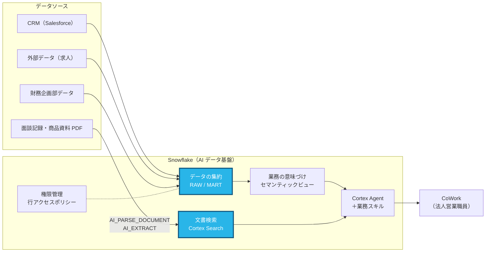

# Part 1: データとカタログを確認する（15分）

> **このページの手順を上から順にコピペして進めれば完了します。**
> 「CoCo に送る」の枠は CoCo パネルに、「SQL」の枠は Workspaces の SQL ファイルに、「CoWork に送る」の枠は ai.snowflake.com のチャット欄に、そのまま貼り付けてください（枠の右上のボタンでコピーできます）。

## この Part で作るところ



**青色の部分** がこの Part で扱うところです。

## なぜ Snowflake でやるのか

> **よくある考え:** 「資料は OneDrive に置けば検索できるし、商談は Salesforce で見られる。わざわざ集める必要はあるの？」

OneDrive の検索は「該当するファイルを見つける」ことは得意ですが、「A ランクの商談の見込み金額を支社別に合計する」ことはできません。
Salesforce のレポートは商談の集計は得意ですが、財務企画部の決算データや外部の求人データ、PDF の面談記録の中身とは組み合わせられません。

営業企画で本当に知りたいのは、たとえば **「売上が伸びていて、求人も増えていて、まだ GLTD を提案していない取引先」** のような、複数のシステムをまたぐ問いです。
AI に答えさせる場合も同じで、**AI が参照できる場所にデータがそろっていなければ、AI はそもそも答えられません。**

Snowflake に集めると、次のことができるようになります。

| | OneDrive / Salesforce それぞれで管理 | Snowflake に集約 |
|---|---|---|
| CRM・財務・外部データの掛け合わせ | 各システムから Excel に書き出して手作業で突き合わせ | 1つの SQL・1つの質問で横断して集計 |
| PDF の中身 | ファイル単位の検索のみ | `AI_EXTRACT` で項目を抜き出して表として集計・検索 |
| データの鮮度 | 書き出した時点で止まる | 元データから定期的に取り込み、常に同じ最新データを参照 |
| AI からの利用 | ツールごとに別々のデータを見る | すべての AI 機能が同じデータを参照 |

この Part では、**「集めたデータがそのままでは AI にも人にも意味が分からない」** ことも確かめます。それが次の Part 2 につながります。

---

## このパートでやること

setup.sql で入ったデータを、Horizon Catalog と CoCo で確認します。
ご提案アーキテクチャのうち、次の部分が1つのアカウントに集まっていることを確かめます。

| ご提案アーキテクチャ | ハンズオンでの置き場所 |
|---|---|
| 構造化データ（Salesforce など） | `SNOWLIFE_HANDSON_DB.RAW.SF_*` |
| 非構造化データ（商談の録音・文書、約款） | `RAW.MEETING_NOTES`、`RAW.DOC_STAGE` の PDF |
| 財務企画部のデータ（データ共有） | `FINANCE_PLANNING_DB.CORP.COMPANY_PL` |
| 外部データ（求人など） | `RAW.EXT_JOB_POSTINGS` |
| データマート | `SNOWLIFE_HANDSON_DB.MART` |

---

## 1-1. Horizon Catalog でテーブルを見る（5分）

1. ナビゲーションメニューの **Catalog » Database Explorer** を開く
2. `SNOWLIFE_HANDSON_DB` » `RAW` » `SF_OPPORTUNITY` を選ぶ
3. **Columns** タブと **Data Preview** タブを確認する

> **ここで気づいてほしいこと**
> `STAGE_CD` に `30`、`RANK_FLG` に `A`、`AMT_EST` に `48000` のような値が入っています。
> 列名と値だけでは「30 は何の段階か」「48000 は円なのか千円なのか」が分かりません。
> 実際の CRM から取り込んだデータも、多くの場合このような状態です。

---

## 1-2. CoCo にデータを説明させる（5分）

画面右下の CoCo アイコンを押してパネルを開き、次のプロンプトを順に送ってください。
`@` を入力するとテーブルを検索して指定できます。

**CoCo に送る**

```
SNOWLIFE_HANDSON_DB にはどんなデータがありますか？スキーマとテーブルごとに1行で説明してください。
```

```
@SF_OPPORTUNITY の STAGE_CD・RANK_FLG・AMT_EST にはどんな値が入っていますか？値の分布も見せてください。
```

```
AMT_EST の単位は円ですか、千円ですか？データから判断できますか？
```

> **ここで気づいてほしいこと**
> CoCo は値の分布までは調べられますが、「千円単位」「90 は受注」といった**業務上の取り決め**は
> データからは確定できません。この取り決めを Snowflake に教えるのが Part 2 のセマンティックビューです。

---

## 1-3. 面談記録 PDF を AI で構造化する（5分）

`RAW.DOC_STAGE/meeting/` に面談記録の PDF が2つ入っています。
Workspaces で新しい SQL ファイルを作り、次の SQL を実行してください。

**SQL**

```sql
USE ROLE ACCOUNTADMIN;
USE WAREHOUSE SNOWLIFE_HANDSON_WH;
USE SCHEMA SNOWLIFE_HANDSON_DB.RAW;

-- (1) PDF を丸ごとテキスト化する
SELECT AI_PARSE_DOCUMENT(
           TO_FILE('@DOC_STAGE', 'meeting/kddi_20260910.pdf'),
           {'mode': 'LAYOUT'}
       ):content::VARCHAR AS CONTENT;

-- (2) PDF から必要な項目だけを抜き出す
SELECT RELATIVE_PATH,
       AI_EXTRACT(
           file => TO_FILE('@DOC_STAGE', RELATIVE_PATH),
           responseFormat => {
               'company':     '面談した企業名は？',
               'meeting_date':'面談日は？（YYYY-MM-DD）',
               'issues':      '先方が挙げた課題を箇条書きで',
               'next_action': '当社の次回アクションは？'
           }
       ) AS EXTRACTED
FROM DIRECTORY(@DOC_STAGE)
WHERE RELATIVE_PATH LIKE 'meeting/%';
```

> **ポイント**
> 商品パンフレットと約款の PDF は、setup.sql の中で同じ方法でテキスト化し、
> `AI.PRODUCT_DOC_SEARCH`（Cortex Search）で検索できるようにしてあります。
> 面談メモ（`RAW.MEETING_NOTES`）も `AI.MEETING_NOTE_SEARCH` で検索できます。
> この2つは Part 3 で Agent のツールとして使います。

---

次は [Part 2: セマンティックビューを作る](part2_semantic_view.md) です。
