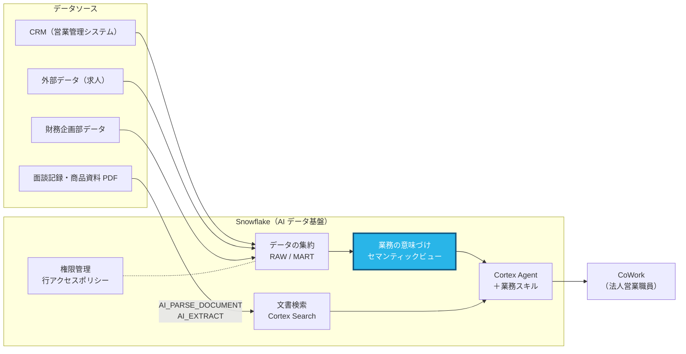

# Part 2: Semantic Studio でセマンティックビューを作る（25分）

> **このページの手順を上から順にコピペして進めれば完了します。**
> 「CoCo に送る」の枠は CoCo パネルに、「SQL」の枠は Workspaces の SQL ファイルに、「CoWork に送る」の枠は ai.snowflake.com のチャット欄に、そのまま貼り付けてください（枠の右上のボタンでコピーできます）。

## この Part で作るところ



**青色の部分** がこの Part で扱うところです。

## なぜ Snowflake でやるのか

> **よくある考え:** 「AI は賢いのだから、データを渡せば意味は勝手に理解してくれるのでは？」

Part 1 で見たとおり、`AMT_EST = 48000` が 4.8万円なのか 4,800万円なのか、`STAGE_CD = 90` が受注なのかは、**データの中には書かれていません。**
こうした取り決めは、今はベテラン社員の頭の中や、表計算ファイルの注記、システムの仕様書に散らばっています。人は経験で補えますが、AI は補えません。もっともらしい数字を自信を持って返してしまいます。

セマンティックビューは、この **業務の取り決めをデータの横に1回だけ書いておく場所** です。

| | 取り決めを各所に散らばらせたまま | セマンティックビューに書く |
|---|---|---|
| 「千円単位」「90=受注」 | 人の記憶・表計算ファイルの注記・仕様書 | データの定義として Snowflake に保存 |
| AI ごとの答えのばらつき | ツールごとに解釈が違い、答えが合わない | Agent・CoCo・BI ツールが同じ定義を使う |
| 「受注件数」の定義変更 | 関係する資料やレポートを全部直す | セマンティックビューを1か所直せば全体に反映 |

**AI の精度を上げる一番の近道は、AI に業務の言葉を教えることです。** この Part の作業が、Part 3 の回答の差になって表れます。

---

## このパートでやること

Part 1 で見た「列名とコード値だけでは意味が分からない」データに、業務上の意味を与えます。
Snowsight の Workspaces にある **Semantic Studio** を使い、CoCo と会話しながら作ります。

作るもの: `SNOWLIFE_HANDSON_DB.AI.SV_SALES_ANALYTICS`

> **名前は必ずこの通りにしてください。** Part 3 の Agent B がこの名前を参照します。

---

## 2-1. CoCo との会話でたたき台を作る（8分）

1. **Projects » Workspaces** を開き、README の手順で追加した `snowlife-corporate-sales-handson` ワークスペースを開く
2. **+ Add new » Semantic View** を選ぶ（Semantic View Autopilot が開きます）
3. CoCo と会話して作る方法を選び、次のプロンプトを送る

**CoCo に送る**

```
このセマンティックビューには、次の8つのテーブルを使ってください。
SNOWLIFE_HANDSON_DB.RAW の SF_ACCOUNT、SF_OPPORTUNITY、SF_ACTIVITY、SF_CONTRACT、SF_USER、MST_PRODUCT。
SNOWLIFE_HANDSON_DB.MART の V_COMPANY_FINANCIALS、V_JOB_POSTINGS。
名前は SV_SALES_ANALYTICS、作成先は SNOWLIFE_HANDSON_DB.AI です。
結合の仕方:
- SF_OPPORTUNITY・SF_ACTIVITY・SF_CONTRACT・V_COMPANY_FINANCIALS・V_JOB_POSTINGS は ACCT_ID で SF_ACCOUNT と結合
- SF_ACCOUNT は OWNER_ID で SF_USER と結合
- SF_OPPORTUNITY と SF_CONTRACT は PRD_CD で MST_PRODUCT と結合
```

4. 生成された `.sv.yaml` がエディタに開くまで待つ

---

## 2-2. 中身を確認する（5分）

エディタの YAML と、フォーム画面（論理テーブルの一覧）の両方を見てください。

| 見るところ | 確認すること |
|---|---|
| 論理テーブル（tables） | 8つのテーブルがあり、主キーが設定されているか |
| リレーション（relationships） | 取引先を中心に、商談・活動・既契約・財務・求人がつながっているか |
| ディメンション / ファクト / メトリクス | どの列が「切り口」、どの列が「数値」として扱われているか |

---

## 2-3. 業務の言葉を手で入れる（7分）

ここがこのハンズオンで一番大事な作業です。
**同義語と説明は、AI に自動生成させず手で入れてください。** Snowflake のドキュメントでも、自動生成した同義語はセマンティックビューの品質を下げやすいため、手入力が推奨されています。

フォーム画面の各項目の **Edit** から、少なくとも次の4つを入れてください（YAML を直接編集しても構いません）。
フォームでは CoCo が付けた名前で表示されるので、元の列名（`AMT_EST` など）を手がかりに探してください。

| 列 | 入れる内容 |
|---|---|
| `SF_OPPORTUNITY.AMT_EST` | 説明: 「見込み金額（年換算保険料）。**千円単位**」。円で集計するため、式を `AMT_EST * 1000` にしたファクトを作るとさらに良い |
| `SF_OPPORTUNITY.STAGE_CD` | 説明: 「10=初回提案、20=ニーズ確認、30=提案中、40=最終交渉、**90=受注**、**99=失注**。進行中は 90・99 以外」 |
| `SF_OPPORTUNITY.RANK_FLG` | 同義語: 「見込みランク」「ランク」。説明: 「S > A > B > C の順に確度が高い」 |
| `SF_ACTIVITY.ACT_TYP` | 説明: 「V=訪問（対面）、O=オンライン面談、T=電話。**訪問は V のみ**」 |

> **フォームで探しにくいときは CoCo に頼めます。** 同じ会話に次を送ると、上の4つを入れた差分を作ってくれます（内容を確認してから反映してください）。

**CoCo に送る**

```
次の説明と同義語を、そのままの文言でセマンティックビューに入れてください。自分で言い換えたり、他の同義語を追加したりしないでください。
- SF_OPPORTUNITY.AMT_EST: 説明「見込み金額（年換算保険料）。千円単位」。さらに式 AMT_EST * 1000 の円単位のファクトと、その合計のメトリクスを追加
- SF_OPPORTUNITY.STAGE_CD: 説明「10=初回提案、20=ニーズ確認、30=提案中、40=最終交渉、90=受注、99=失注。進行中は 90・99 以外」
- SF_OPPORTUNITY.RANK_FLG: 同義語「見込みランク」「ランク」。説明「S > A > B > C の順に確度が高い」
- SF_ACTIVITY.ACT_TYP: 説明「V=訪問（対面）、O=オンライン面談、T=電話。訪問は V のみ」
- SF_ACCOUNT.BR_CD: 説明「T01=東京第一法人営業部、T02=東京第二法人営業部、K01=関西法人営業部、C01=中部法人営業部」
- SF_ACCOUNT.IND_CD: 説明「MFG=製造業、TRD=商社、ITC=情報通信業、FIN=金融業、ENE=電気・ガス業、RTL=小売業、CON=建設業、TRN=運輸業、RES=不動産業」
- SF_CONTRACT.STS_CD: 説明「1=有効、9=解約」
```

時間があれば次も入れてみてください（上の CoCo プロンプトには含まれています）。

- `SF_ACCOUNT.BR_CD`: 「T01=東京第一法人営業部、T02=東京第二法人営業部、K01=関西法人営業部、C01=中部法人営業部」
- `SF_ACCOUNT.IND_CD`: 「MFG=製造業、TRD=商社、ITC=情報通信業、FIN=金融業、ENE=電気・ガス業、RTL=小売業、CON=建設業、TRN=運輸業、RES=不動産業」
- `SF_CONTRACT.STS_CD`: 「1=有効、9=解約」

---

## 2-4. カスタム指示と検証済みクエリを CoCo に追加させる（5分）

同じ CoCo の会話に、次のプロンプトを送ってください。

**CoCo に送る**

```
このセマンティックビューに次を追加してください。
1. カスタム指示（SQL 生成）: 年度は4月始まり。金額は円で返す。「訪問」は ACT_TYP = 'V' のみ。
2. 検証済みクエリ: 「進行中の商談の見込みランク別の件数と見込み金額合計（円）」
```

追加されたら、右上の **Deploy** を押します。差分プレビューを確認してから反映してください。

Deploy できたら、SQL ファイルで次を実行し、見込み金額が**円**で返ることを確認します（セマンティックビューは SQL からも直接クエリできます）。

**SQL**

```sql
SELECT * FROM SEMANTIC_VIEW(
    SNOWLIFE_HANDSON_DB.AI.SV_SALES_ANALYTICS
    DIMENSIONS OPPORTUNITIES.PROSPECT_RANK
    METRICS OPPORTUNITIES.TOTAL_EXPECTED_PREMIUM_JPY, OPPORTUNITIES.OPPORTUNITY_COUNT
    WHERE OPPORTUNITIES.IS_OPEN
) ORDER BY PROSPECT_RANK;
```

> 論理テーブル名・ディメンション名・メトリクス名は、完成版（answers）の名前です。
> 自分で作ったセマンティックビューで動かないときは、CoCo に「この SQL が私のセマンティックビューで動くように直して」と頼んでください。
> 完成版の場合、A ランクは 17件・1,156,322,000円 になります。

---

## 間に合わなかった場合

`answers/part2_semantic_view.sql` を SQL ファイルで開いて実行すると、完成版が作成されます。
YAML 版は `answers/part2_semantic_view.yaml` です。Semantic Studio の `.sv.yaml` に貼り付けて Deploy しても同じ結果になります。

---

次は [Part 3: Cortex Agent の精度を比べる](part3_agent_ab.md) です。
