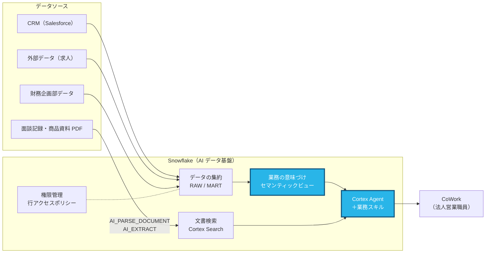

# Part 3: Cortex Agent を作って精度を比べる（20分）

> **このページの手順を上から順にコピペして進めれば完了します。**
> 「SQL」の枠は Workspaces の SQL ファイルに、「CoWork に送る」の枠は ai.snowflake.com のチャット欄に、
> 「入力する値」の表は Snowsight の画面の各欄に、そのままコピーして貼り付けてください。

## この Part で作るところ



**青色の部分** がこの Part で扱うところです。

## なぜ Snowflake でやるのか

> **よくある考え:** 「生成 AI に資料を読ませれば、それなりに答えてくれる。数字が多少違っても大きな問題はないのでは？」

ファイル検索型の AI は、文章を読んで要約することは得意です。一方で「見込み金額の合計」のような数字を聞くと、文書の断片から **それらしい数字を作って答える** ことがあります。どの数字をどう足したのかは、利用者からは確かめられません。

Cortex Agent は、数字の質問には **セマンティックビューを使って実際に SQL を実行** して答えます。

| | ファイル検索型の AI | Snowflake の Cortex Agent |
|---|---|---|
| 数字の出し方 | 文書の記述から推測することがある | データに対して SQL を実行して集計 |
| 根拠の確認 | どの数字を使ったか分かりにくい | 思考ステップで、使った SQL と結果をそのまま確認できる |
| 間違えたときの改善 | プロンプトを工夫するしかない | Monitoring で誤答を特定し、セマンティックビューを直して全体の精度を上げる |
| 文章の検索 | 得意 | Cortex Search で同様に可能。数字と文章を1つの回答にまとめられる |

この Part で一番見てほしいのは、**A の誤答が「自然な数字に見える」こと** です。保険の営業で誤った数字が提案書や報告に載ると、信頼に関わります。
**答えの根拠を確かめられて、間違いを仕組みで直せる** ことが、業務で AI を使うための条件です。

---

## このパートでやること

ツールも指示文も同じ2つの Agent を作り、同じ質問を投げて回答を比べます。
違いは Cortex Analyst ツールが参照するセマンティックビューだけです。

| Agent | 表示名 | セマンティックビュー |
|---|---|---|
| A: `AI.SALES_AGENT_BASIC` | 法人営業アシスタント（A: 意味づけなし） | `AI.SV_SALES_MINIMAL`（テーブル・主キー・リレーションのみ。setup.sql で作成済み） |
| B: `AI.SALES_AGENT` | 法人営業アシスタント（B: 意味づけあり） | `AI.SV_SALES_ANALYTICS`（Part 2 で作成） |

---

## 3-0. 事前確認（1分）

**SQL**

```sql
SHOW SEMANTIC VIEWS IN SCHEMA SNOWLIFE_HANDSON_DB.AI;
```

`SV_SALES_MINIMAL` と `SV_SALES_ANALYTICS` の2行が出れば OK です。
`SV_SALES_ANALYTICS` がなければ、先に `answers/part2_semantic_view.sql` を開いて **Run All** してください。

---

## 3-1. Agent を作る（5〜10分）

作り方を **どちらか1つ** 選んでください。どちらでも、できあがる Agent は同じです。

| | 方法1: SQL で作る（おすすめ・2分） | 方法2: 画面で Agent B を作る（10分） |
|---|---|---|
| 向いている人 | 比較を早く始めたい | Agent の設定項目を自分の手で確かめたい |

### 方法1: SQL で作る

1. Workspaces で `answers/part3_agents.sql` を開く
2. **Run All** を押す
3. 最後の結果（`SHOW AGENTS`）に `SALES_AGENT_BASIC` と `SALES_AGENT` の2行が出れば完了 → **3-2 へ**

### 方法2: 画面で Agent B を作る

#### (1) Agent を作成する

1. ナビゲーションメニューの **AI & ML » Agents** を開き、**Create agent** を押す
2. 次の値を入れて **Create agent** を押す

| 項目 | 入力する値 |
|---|---|
| データベース / スキーマ（選択欄がある場合） | `SNOWLIFE_HANDSON_DB` / `AI` |
| Agent object name | `SALES_AGENT` |
| Display name | `法人営業アシスタント（B: 意味づけあり）` |

#### (2) 説明を入れる

作成した Agent を開いて **Edit** を押し、**Description** に貼り付けます。

```
スノー生命 法人営業アシスタント
```

#### (3) ツールを3つ追加する

**Tools** を開き、次の3つを追加します。

**ツール1: Cortex Analyst** → **Cortex Analyst** の **+ Add**

| 項目 | 入力する値 |
|---|---|
| Name | `sales_analytics` |
| Semantic view | `SNOWLIFE_HANDSON_DB.AI.SV_SALES_ANALYTICS` を選ぶ |
| Warehouse | `SNOWLIFE_HANDSON_WH` を選ぶ |
| Query timeout (seconds) | `60` |
| Description | 下の枠をコピー |

```
法人営業の取引先・商談・活動履歴・既契約・企業財務・求人件数を SQL で集計するツール。件数・金額・一覧・ランキングの質問に使う。
```

**ツール2: 面談メモ検索** → **Cortex Search Services** の **+ Add**

| 項目 | 入力する値 |
|---|---|
| Name | `meeting_notes_search` |
| Description | 下の枠をコピー |
| Search service | `SNOWLIFE_HANDSON_DB.AI.MEETING_NOTE_SEARCH` を選ぶ |
| ID column | `NOTE_ID` |
| Title column | `ACCT_NM` |
| Source stage / Relative path column | 空欄のまま |

```
営業職員が記録した面談メモを検索するツール。先方が何を話したか、課題・関心事・次回アクションを調べるときに使う。
```

**ツール3: 商品資料検索** → **Cortex Search Services** の **+ Add**

| 項目 | 入力する値 |
|---|---|
| Name | `product_docs_search` |
| Description | 下の枠をコピー |
| Search service | `SNOWLIFE_HANDSON_DB.AI.PRODUCT_DOC_SEARCH` を選ぶ |
| ID column | `RELATIVE_PATH` |
| Title column | `RELATIVE_PATH` |
| Source stage | `@SNOWLIFE_HANDSON_DB.RAW.DOC_STAGE` |
| Relative path column | `RELATIVE_PATH` |

```
スノー生命の商品パンフレット・約款を検索するツール。商品の特長・引受条件・約款の規定を調べるときに使う。
```

> Source stage を入れておくと、CoWork の回答の引用から PDF をその場で開けます。

#### (4) 指示文を入れる

**Orchestration** を開き、次の値を入れます。

| 項目 | 入力する値 |
|---|---|
| Orchestration model | `auto` |
| Planning instructions | 下の1つ目の枠をコピー |
| Response instruction | 下の2つ目の枠をコピー |

**Planning instructions（オーケストレーションの指示）**

```
あなたはスノー生命保険 法人営業部門のアシスタントです。利用者は法人営業職員と営業企画部の担当者で、取引先・商談・既契約・面談・商品について質問します。

【ツールの使い分け】
1. 件数・金額・一覧・ランキング・推移など、数値で答える質問は sales_analytics を使う。
2. 面談で先方が話した内容、課題・関心事、宿題・次回アクションは meeting_notes_search を使う。
3. 商品の特長・引受条件・保障内容・約款の規定は product_docs_search を使う。
4. 「〇〇社の状況を教えて」のように複数の観点が必要な質問は、sales_analytics で商談・既契約を確認したうえで、meeting_notes_search で面談の内容を補う。商品の提案に触れる場合は product_docs_search で根拠を確認する。

【質問の読み取り方】
- 企業名が略称の場合（例: トヨタ、パナ）は、取引先名にその語を含む企業として扱う。候補が複数あるときは、どの企業か確認する。
- 期間の指定がない場合は全期間を対象にし、そのことを回答に書く。
- 解釈によって答えが大きく変わる質問は、推測で進めずに確認の質問を1つ返す。

【守ること】
- ツールで得た結果だけをもとに答える。データにないことは推測で補わず「データなし」と書く。
- ツールの結果の数値を、自分の判断で換算・補正しない。
```

**Response instruction（応答の指示）**

```
【回答の形】
- 日本語で答える。最初の1〜2文で結論（数値・企業名など）を書き、その後に内訳や根拠を書く。
- 一覧や比較は表で示す。11件以上になる場合は上位10件を示し、全体の件数を添える。
- 数値には必ず単位（円・件・名・%）を付ける。金額は「4億2,718万2,000円」のように桁区切りと万・億を使って読みやすく書く。
- 数値で答えた場合は、最後に「集計条件:」として対象期間・対象支社・商談の状態などの条件を1行で書く。
- 面談メモや商品資料を使った場合は、どの企業の何月何日の面談か、どの資料のどの記述かが分かるように示す。

【表現の注意】
- 保険の募集に関わる内容では、「必ず」「確実に」「絶対に」「損をしない」などの断定的な表現を使わない。
- 税務上の取扱いに触れる場合は、「一般的な取扱いであり、個別の判断は税理士等の専門家にご確認ください」と添える。
- 被保険者個人の健康状態や病歴に関する情報は回答に含めない。
```

> この2つの文章の考え方は、下の「3-4. 指示文の書き方」で説明しています。

#### (5) 保存する

右上の **Save** を押します。

#### (6) 比較用の Agent A を作り、2つとも CoWork に表示する

Agent A は B とセマンティックビューだけが違うので、SQL でまとめて作ります。次をそのまま実行してください。

**SQL**

```sql
USE ROLE ACCOUNTADMIN;
USE WAREHOUSE SNOWLIFE_HANDSON_WH;

CREATE OR REPLACE AGENT SNOWLIFE_HANDSON_DB.AI.SALES_AGENT_BASIC
    COMMENT = '比較用。意味づけのない最小セマンティックビューを使う法人営業 Agent'
    PROFILE = '{"display_name": "法人営業アシスタント（A: 意味づけなし）"}'
    FROM SPECIFICATION
$$
models:
  orchestration: auto
instructions:
  response: |
    【回答の形】
    - 日本語で答える。最初の1〜2文で結論（数値・企業名など）を書き、その後に内訳や根拠を書く。
    - 一覧や比較は表で示す。11件以上になる場合は上位10件を示し、全体の件数を添える。
    - 数値には必ず単位（円・件・名・%）を付ける。金額は「4億2,718万2,000円」のように桁区切りと万・億を使って読みやすく書く。
    - 数値で答えた場合は、最後に「集計条件:」として対象期間・対象支社・商談の状態などの条件を1行で書く。
    - 面談メモや商品資料を使った場合は、どの企業の何月何日の面談か、どの資料のどの記述かが分かるように示す。

    【表現の注意】
    - 保険の募集に関わる内容では、「必ず」「確実に」「絶対に」「損をしない」などの断定的な表現を使わない。
    - 税務上の取扱いに触れる場合は、「一般的な取扱いであり、個別の判断は税理士等の専門家にご確認ください」と添える。
    - 被保険者個人の健康状態や病歴に関する情報は回答に含めない。
  orchestration: |
    あなたはスノー生命保険 法人営業部門のアシスタントです。利用者は法人営業職員と営業企画部の担当者で、取引先・商談・既契約・面談・商品について質問します。

    【ツールの使い分け】
    1. 件数・金額・一覧・ランキング・推移など、数値で答える質問は sales_analytics を使う。
    2. 面談で先方が話した内容、課題・関心事、宿題・次回アクションは meeting_notes_search を使う。
    3. 商品の特長・引受条件・保障内容・約款の規定は product_docs_search を使う。
    4. 「〇〇社の状況を教えて」のように複数の観点が必要な質問は、sales_analytics で商談・既契約を確認したうえで、meeting_notes_search で面談の内容を補う。商品の提案に触れる場合は product_docs_search で根拠を確認する。

    【質問の読み取り方】
    - 企業名が略称の場合（例: トヨタ、パナ）は、取引先名にその語を含む企業として扱う。候補が複数あるときは、どの企業か確認する。
    - 期間の指定がない場合は全期間を対象にし、そのことを回答に書く。
    - 解釈によって答えが大きく変わる質問は、推測で進めずに確認の質問を1つ返す。

    【守ること】
    - ツールで得た結果だけをもとに答える。データにないことは推測で補わず「データなし」と書く。
    - ツールの結果の数値を、自分の判断で換算・補正しない。
tools:
  - tool_spec:
      type: "cortex_analyst_text_to_sql"
      name: "sales_analytics"
      description: "法人営業の取引先・商談・活動履歴・既契約・企業財務・求人件数を SQL で集計するツール。件数・金額・一覧・ランキングの質問に使う。"
  - tool_spec:
      type: "cortex_search"
      name: "meeting_notes_search"
      description: "営業職員が記録した面談メモを検索するツール。先方が何を話したか、課題・関心事・次回アクションを調べるときに使う。"
  - tool_spec:
      type: "cortex_search"
      name: "product_docs_search"
      description: "スノー生命の商品パンフレット・約款を検索するツール。商品の特長・引受条件・約款の規定を調べるときに使う。"
tool_resources:
  sales_analytics:
    semantic_view: "SNOWLIFE_HANDSON_DB.AI.SV_SALES_MINIMAL"
    execution_environment:
      type: "warehouse"
      warehouse: "SNOWLIFE_HANDSON_WH"
  meeting_notes_search:
    search_service: "SNOWLIFE_HANDSON_DB.AI.MEETING_NOTE_SEARCH"
    max_results: 5
    id_column: "NOTE_ID"
    title_column: "ACCT_NM"
  product_docs_search:
    search_service: "SNOWLIFE_HANDSON_DB.AI.PRODUCT_DOC_SEARCH"
    max_results: 5
    id_column: "RELATIVE_PATH"
    title_column: "RELATIVE_PATH"
    stage_path: "@SNOWLIFE_HANDSON_DB.RAW.DOC_STAGE"
    relative_path_column: "RELATIVE_PATH"
$$;

-- 2つの Agent を CoWork に表示する（追加済みでもエラーになりません）
EXECUTE IMMEDIATE $$
BEGIN
    ALTER SNOWFLAKE INTELLIGENCE SNOWFLAKE_INTELLIGENCE_OBJECT_DEFAULT ADD AGENT SNOWLIFE_HANDSON_DB.AI.SALES_AGENT_BASIC;
    RETURN 'A を CoWork に追加しました';
EXCEPTION WHEN OTHER THEN RETURN 'A は追加済みです';
END;
$$;

EXECUTE IMMEDIATE $$
BEGIN
    ALTER SNOWFLAKE INTELLIGENCE SNOWFLAKE_INTELLIGENCE_OBJECT_DEFAULT ADD AGENT SNOWLIFE_HANDSON_DB.AI.SALES_AGENT;
    RETURN 'B を CoWork に追加しました';
EXCEPTION WHEN OTHER THEN RETURN 'B は追加済みです';
END;
$$;

GRANT USAGE ON AGENT SNOWLIFE_HANDSON_DB.AI.SALES_AGENT_BASIC TO ROLE SNOWLIFE_SALES_REP_T01;
GRANT USAGE ON AGENT SNOWLIFE_HANDSON_DB.AI.SALES_AGENT       TO ROLE SNOWLIFE_SALES_REP_T01;

SHOW AGENTS IN SCHEMA SNOWLIFE_HANDSON_DB.AI;
```

最後の結果に `SALES_AGENT_BASIC` と `SALES_AGENT` の2行が出れば完了です。

> **画面での作成がうまくいかなかったら:** 方法1（`answers/part3_agents.sql` の Run All）に切り替えてください。
> 画面で作った `SALES_AGENT` は同じ設定で作り直されるので、そのまま先に進めます。

---

## 3-2. 同じ質問を2つの Agent に投げる（10分）

1. [ai.snowflake.com](https://ai.snowflake.com) を**2つのタブ**で開く
2. 片方のタブで **法人営業アシスタント（A: 意味づけなし）**、もう片方で **法人営業アシスタント（B: 意味づけあり）** を選ぶ
   （一覧に出ないときはタブを再読み込みしてください）
3. 次の4問を両方に投げ、[scoresheet.md](scoresheet.md) に ○ / △ / × を付ける

**CoWork に送る**

```
進行中の商談のうち、見込みランクがAの商談の見込み金額合計を支社別に円で教えて
```

```
2026年度上期に受注した商談の件数と見込み金額の合計（円）を教えて
```

```
GLTDの進行中の商談の件数と見込み金額の合計（円）を教えて
```

```
2025年度の売上高が前年度より増えていて、進行中の商談がある取引先を教えて
```

正解は [eval_questions.md](eval_questions.md) の Q1・Q2・Q8・Q9 です。
時間があれば残りの6問も試してください。

> **回答の「思考ステップ」を開いてください**
> 生成された SQL を見ると、A は `AMT_EST` をそのまま合計し、B は `AMT_EST * 1000` を使っていることが分かります。
> A の回答は「数字としては自然に見える」ため、誤りに気づきにくいのがポイントです。

---

## 3-3. 間違えた回答を Semantic Studio で直す（5分）

Agent の誤答は、Semantic Studio の CoCo に調べさせて直せます。本番運用でも、この流れで精度を上げていきます。

1. **AI & ML » Agents** で `SALES_AGENT_BASIC`（A）を開き、**Monitoring** タブを開く
2. 3-2 で A が間違えた質問（例: 2問目の「2026年度上期に受注した…」）のリクエストを選び、**リクエスト ID** をコピーする
3. **Projects » Workspaces** を開き、CoCo パネルに次を送る（既存のセマンティックビューを開きます。新規作成はしません）

**CoCo に送る**

```
SNOWLIFE_HANDSON_DB.AI.SV_SALES_MINIMAL を Semantic Studio で開いて
```

4. 開いたら、同じ CoCo の会話に次を送る（`<コピーしたID>` を 2 でコピーした ID に置き換える）

**CoCo に送る**

```
このリクエストの回答が間違っていました。リクエスト ID: <コピーしたID>
正しい見込み金額の合計は 427,182,000円 です。原因と修正案を教えてください。
```

5. CoCo が原因（例:「AMT_EST が千円単位であることが定義されていない」）と修正の差分を示すので、内容を確認する

> **注意:** ここでは修正案を確認するところまでで止めてください。**Deploy は押さないでください。**
> Deploy すると `SV_SALES_MINIMAL` が変わり、A と B の比較ができなくなります。

---

## 3-4. 指示文の書き方（読み物・3分）

### A と B の指示文が同じ理由

この比較では、**A と B に同じ指示文** を入れています。指示文まで変えると、回答の違いがセマンティックビューによるものか、指示文によるものか分からなくなるためです。

この指示文は「セマンティックビューを整備した Agent（B）」を前提に書いています。考え方は次のとおりです。

| 書く場所 | 書く内容 | 例 |
|---|---|---|
| **セマンティックビュー** | データの意味・単位・コード値・指標の定義・年度の区切り | 「AMT_EST は千円単位」「90=受注」「年度は4月始まり」 |
| **オーケストレーションの指示** | どのツールをどんな質問で使うか、質問の読み取り方、守ること | 「数値の質問は sales_analytics」「略称は取引先名で探す」 |
| **応答の指示** | 回答の形・単位の書き方・表現の注意 | 「結論から書く」「断定表現を使わない」 |

データの取り決めをセマンティックビューにまとめておくと、Agent B だけでなく、Cortex Analyst を使う他の Agent や、SQL で `SEMANTIC_VIEW()` を呼ぶ BI ツールなど、同じセマンティックビューを使うすべての仕組みで同じ定義が使われます。

### セマンティックビューを整備しない場合はどうなるか

「セマンティックビューを作らずに、Agent の指示文に取り決め（千円単位、90=受注 など）を書けばよいのでは？」という疑問が出ることがあります。
講師のリハーサルで、A の指示文に取り決めを書き足して同じ質問を試した結果（抜粋）は次のとおりでした。

| 質問 | A（意味づけなし） | A + 指示文に取り決めを追記 | B（意味づけあり） |
|---|---|---|---|
| Q2（2026年度上期の受注） | × 千円のまま | ○ | ○ |
| Q8（GLTD の進行中商談） | × | × 指示文に「GLTD = P02」を書き漏らしたため | ○ |

- 書いた取り決めはある程度効きますが、**書き漏らした取り決めは効きません。**
- 取り決めは Agent ごとに書き写すことになり、増えるほど管理が大変になります。
- セマンティックビューに置いた取り決めは、同じセマンティックビューを使うすべての Agent や BI ツールで共通に使われます。

本番では、**データの取り決めはセマンティックビューに置き、指示文はツールの使い分けと回答の形に絞る** 構成をおすすめします。

---

## 時間があれば: Evaluations タブで一括評価する（講師デモ）

Agent の **Evaluations** タブでは、質問と正解のセットを用意して、Agent の回答をまとめて採点できます（answer_correctness などの指標）。
Agent の設定を変えるたびに同じセットで評価し直すと、精度が上がったか下がったかを数値で追えます。

---

次は [Part 4: 法人営業の業務フローをスキルにする](part4_skill.md) です。
