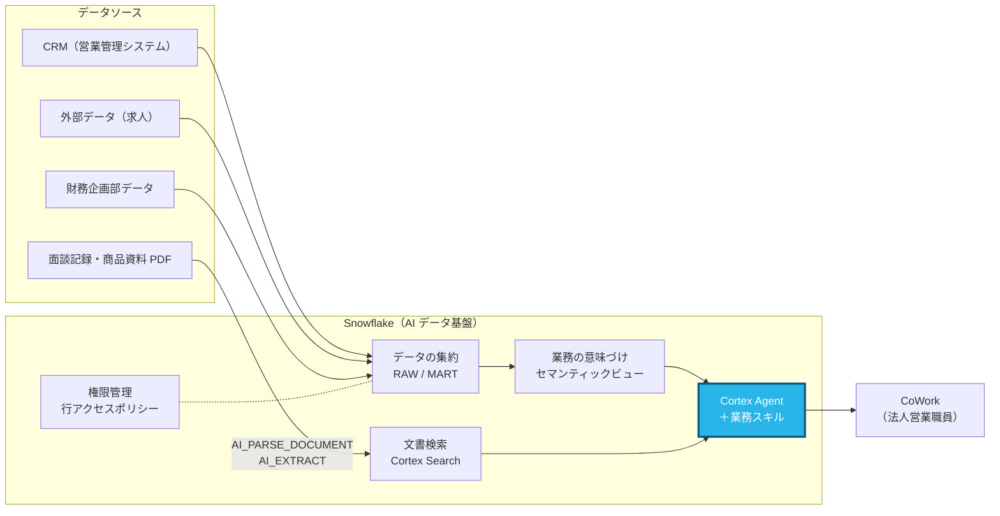

# Part 4: 法人営業の業務フローをスキルにする（25分）

> **このページの手順を上から順にコピペして進めれば完了します。**
> 灰色の枠（コードブロック）は右上のコピーボタンでそのままコピーできます。
> 「CoCo に送る」と書いてある枠は CoCo パネルに、「SQL」と書いてある枠は Workspaces の SQL ファイルに貼り付けてください。

## この Part で作るところ



**青色の部分** がこの Part で扱うところです。

## なぜ Snowflake でやるのか

> **よくある考え:** 「うまく使える人が良いプロンプトを書けば十分。共有したければ社内チャットにプロンプトを貼っておけばよいのでは？」

プロンプトの工夫は個人の技術になりがちで、使う人によって出てくる資料の質がばらつきます。チャットで共有したプロンプトは、コピーされるうちに古い版が出回り、どれが正しいか分からなくなります。

スキルは、**「訪問前に何を確認して、どの順番でまとめるか」という組織の業務の型** を、Agent に1か所で持たせる仕組みです。

| | 個人のプロンプト | Agent のスキル |
|---|---|---|
| 品質 | 書く人の腕次第 | 全員が同じ手順・同じフォーマットで資料を作れる |
| 更新 | 各自のコピーを直してもらう | ステージの SKILL.md を直せば、次の質問から全員に反映 |
| 使うデータ | 個人が手元に持っている資料 | 権限の範囲で、全社で集約した最新データ |
| ルールの徹底 | 個人の注意に頼る | 「断定表現を使わない」などを手順に組み込める |

ベテランの訪問準備のやり方を、新人もすぐに再現できる。**データ基盤の上に業務の型を載せることで、AI が組織の力になります。**

---

## このパートでやること

「訪問前にこれを確認して、この形にまとめる」という法人営業の業務の型を、
Cortex Agent の **スキル（Agent skill）** として登録します。

スキルは `SKILL.md` という1つのテキストファイルです。中身は次の3つです。

| 項目 | 役割 |
|---|---|
| `name` | スキルの名前 |
| `description` | どんな依頼のときに使うか。Agent はこれを読んで、使うかどうかを判断します |
| 本文（手順） | 使うことになったときに Agent が従う手順と出力フォーマット |

> **混同しやすい点**
> Workspaces の `.snowflake/cortex/skills` に置くスキルは **CoCo 用**（開発者の作業を助けるもの）です。
> このパートで作るのは **Cortex Agent 用**のスキルで、ステージに置いた `SKILL.md` を Agent に登録します。
> CoWork で営業職員が使うのは後者です。

---

## 4-1. 自分たちの業務フローを言葉にする（5分）

次の問いに、自社の実際の業務で答えてみてください（メモで構いません）。

- 訪問の前日に、営業職員は何を確認していますか？
- その情報はどのシステムにありますか？
- 上司に報告するとき、どんな項目の順番でまとめますか？
- 言ってはいけないこと、必ず添えることはありますか？

---

## 4-2. CoCo と一緒に SKILL.md を書く（8分）

1. **Projects » Workspaces** で `snowlife-corporate-sales-handson` を開く
2. 画面右下の CoCo アイコンでパネルを開き、次を送る（4-1 のメモがあれば手順部分を自社の内容に書き換えてください）

**CoCo に送る**

```
Cortex Agent 用のスキルファイルを作ってください。
ファイル: my-skills/pre-visit-briefing/SKILL.md
先頭に YAML フロントマター（--- で囲む）で name と description を書き、その後に Markdown で手順・出力フォーマット・注意事項を書いてください。
name: pre-visit-briefing
description: 法人営業職員が顧客企業を訪問する前の準備資料（訪問前ブリーフィング）を作る。「〇〇社の訪問準備をして」「〇〇社のブリーフィングを作って」といった依頼で使う。
手順:
  1. 面談メモ検索ツール（meeting_notes_search）で対象企業の直近の面談を3件確認する
  2. 営業分析ツール（sales_analytics）で進行中の商談・有効な既契約・最終訪問日を確認する
  3. 営業分析ツール（sales_analytics）で直近2年度の売上高と、直近3か月の求人件数の前年比を確認する
  4. 商品資料検索ツール（product_docs_search）で、課題に合う商品の根拠を探す
出力フォーマット: 直近の面談サマリー / 未対応の宿題 / 商談・既契約 / 企業の変化 / 推奨する提案と根拠 / 想定Q&A 3つ
注意: 金額は円で書く。データにないことは書かない。「必ず」「確実に」などの断定表現は使わない。
```

3. `my-skills/pre-visit-briefing/SKILL.md` ができたら開いて、中身を確認する

> 見本は [answers/skills/pre-visit-briefing/SKILL.md](../answers/skills/pre-visit-briefing/SKILL.md) です。
> 4-3 の SQL にも見本と同じ内容が入っているので、CoCo の生成がうまくいかなくても先に進めます。

---

## 4-3. SKILL.md をステージに置く（4分）

ファイルのダウンロード・アップロードは不要です。SQL に SKILL.md の中身を貼って、ステージに書き出します。

1. Workspaces で **+ Add new » SQL File** を作る
2. 次の SQL を貼り付ける
3. 自分で作った SKILL.md を使う場合は、`$$` と `$$` の間を 4-2 のファイルの中身に**丸ごと置き換える**（そのままなら見本が登録されます）
4. **Run All** で実行する

**SQL**

```sql
USE ROLE ACCOUNTADMIN;
USE WAREHOUSE SNOWLIFE_HANDSON_WH;

COPY INTO @SNOWLIFE_HANDSON_DB.AI.SKILL_STAGE/skills/pre-visit-briefing/SKILL.md
FROM (SELECT $$---
name: pre-visit-briefing
description: 法人営業職員が顧客企業を訪問する前の準備資料（訪問前ブリーフィング）を作る。「〇〇社の訪問準備をして」「〇〇社に明日行くので事前に押さえることを教えて」「〇〇社のブリーフィングを作って」といった依頼で使う。
---

# 訪問前ブリーフィング

法人営業職員が顧客企業を訪問する前に、社内データをまとめて1枚のブリーフィングにする手順です。
以下の順番で情報を集め、最後に決まったフォーマットで出力してください。

## 手順

1. **対象企業を特定する**
   依頼文から企業名を読み取る。曖昧な場合（例:「トヨタ」）は取引先名で一致する企業を1社に決めてから進める。

2. **直近の面談内容を確認する**（面談メモ検索ツール `meeting_notes_search`）
   - 対象企業の面談メモを新しい順に最大3件取得する。
   - それぞれの「テーマ」「先方の反応」「次回アクション」を抜き出す。

3. **商談と既契約の状況を確認する**（営業分析ツール `sales_analytics`）
   - 進行中の商談（受注・失注以外）を、商品名・見込みランク・見込み金額（円）・完了予定日で一覧にする。
   - 有効な既契約の商品名と年間保険料（円）を一覧にする。
   - 直近の訪問日（活動種別が訪問のもの）を確認する。

4. **企業の変化を確認する**（営業分析ツール `sales_analytics`）
   - 財務企画部データから、直近2年度の売上高と営業利益の増減を確認する。
   - 求人件数の直近3か月合計を、前年同期と比べる。

5. **提案の方向性を決める**（商品資料検索ツール `product_docs_search`）
   - 2〜4で分かった課題や変化に合う商品を1〜2つ選び、商品資料から根拠となる記述を引用する。

## 出力フォーマット

以下の見出しをこの順番で使い、各項目は箇条書きで簡潔に書く。

## 〇〇社 訪問前ブリーフィング（作成日: YYYY-MM-DD）
### 1. 直近の面談サマリー
### 2. 未対応の宿題・次回アクション
### 3. 商談・既契約の状況
### 4. 企業の変化（財務・採用）
### 5. 推奨する提案と根拠
### 6. 想定される質問と回答案（3つ）

## 注意事項

- 金額は必ず円単位で表記する（例: 1億2,000万円）。
- データにない事実を推測で書かない。分からない項目は「データなし」と書く。
- 「必ず」「確実に」「絶対に」などの断定表現は使わない（保険業法上の不適切表現にあたる場合があるため）。
$$)
FILE_FORMAT = (TYPE = CSV COMPRESSION = NONE FIELD_OPTIONALLY_ENCLOSED_BY = NONE ESCAPE_UNENCLOSED_FIELD = NONE)
SINGLE = TRUE OVERWRITE = TRUE HEADER = FALSE;

-- 3つのスキルが並んでいれば成功（proposal-prep と compliance-check は setup.sql で配置済み）
LS @SNOWLIFE_HANDSON_DB.AI.SKILL_STAGE/ PATTERN = '.*SKILL\.md';
```

**確認:** 最後の結果に次の3行が出ていれば OK です。

- `skill_stage/skills/compliance-check/SKILL.md`
- `skill_stage/skills/pre-visit-briefing/SKILL.md`
- `skill_stage/skills/proposal-prep/SKILL.md`

> **注意:** 貼り付ける SKILL.md の中に `$$` という文字列があるとエラーになります（通常は含まれません）。

---

## 4-4. Agent B にスキルを登録する（4分）

### 画面で登録する場合

1. ナビゲーションメニューの **AI & ML » Agents** を開く
2. 一覧から `SALES_AGENT`（法人営業アシスタント（B: 意味づけあり））を選び、**Edit** を押す
3. **Skills** タブで **Add Skill** を押し、ソースに **Stage** を選ぶ
4. 次の値を入れて **Add Skill** を押す

| 項目 | 入力する値 |
|---|---|
| Stage | `SNOWLIFE_HANDSON_DB.AI.SKILL_STAGE` |
| Skill folder path | `skills/pre-visit-briefing` |

5. 同じ手順で、パスだけ変えてあと2つ追加する

| 2つ目 | 3つ目 |
|---|---|
| `skills/proposal-prep` | `skills/compliance-check` |

6. 右上の **Save** を押す

> パスの入力欄が1つだけの画面では、`@SNOWLIFE_HANDSON_DB.AI.SKILL_STAGE/skills/pre-visit-briefing` のようにステージ名から続けて入れてください。

### SQL で登録する場合（画面でうまくいかないとき）

`answers/part4_skill.sql` を Workspaces で開いて **Run All** してください。3つのスキルがまとめて登録されます。

> この SQL は、見本の SKILL.md をステージに書き直してから登録します。
> 自分で作った SKILL.md を使いたい場合は、この SQL を実行した後にもう一度 4-3 の SQL（自分の内容を貼ったもの）を実行してください。
> スキルの中身は次回の質問から反映されます。

### 確認

**SQL**

```sql
DESCRIBE AGENT SNOWLIFE_HANDSON_DB.AI.SALES_AGENT;
```

結果の `agent_spec` 列に `pre-visit-briefing`・`proposal-prep`・`compliance-check` の3つが含まれていれば成功です。

---

## 4-5. CoWork で使ってみる（4分）

1. [ai.snowflake.com](https://ai.snowflake.com) を開く（開いていたタブは再読み込みする）
2. Agent に **法人営業アシスタント（B: 意味づけあり）** を選ぶ
3. 次の3つを順に送る

**CoWork に送る**

```
KDDIの訪問準備をして
```

```
パナソニック向けに、DC移行の提案の骨子をまとめて
```

```
この文面に問題がないか確認して：「GLTDに加入すれば、確実に税負担が軽減され、従業員の離職もなくなります」
```

確認するポイント:

- [ ] 回答の思考ステップに、スキルが使われたことが表示されている
- [ ] 1問目の出力が、SKILL.md の見出し（1. 直近の面談サマリー 〜 6. 想定される質問）の順になっている
- [ ] 金額が円で書かれ、断定表現が使われていない
- [ ] 3問目で「確実に」「なくなります」が不適切表現として指摘される

> **スキルが使われないとき**
> チャット入力欄の **+** ボタンからスキル（`pre-visit-briefing` など）を選んでから、もう一度送ってください。
> それでも使われない場合は、`description` に「どんな依頼で使うか」の例文を増やして 4-3 の SQL を再実行してください。

---

次は [Part 5: 営業職員として CoWork を使う](part5_cowork.md) です。
